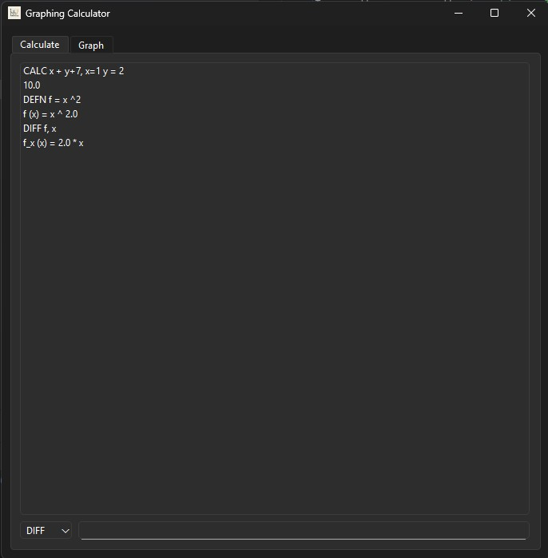
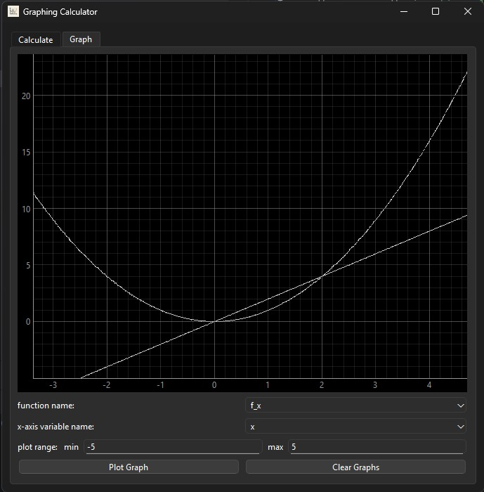

### Graphing Calculator App
A calculator that can perform algebraic calculations, define functions and calculate derivatives as well as plot these functions on a graph.

To use the app, run the `graphing_calculator_app.py` file.

The calculator interprets text into tokens (of numbers, symbols and variables/functions), before utilising the Shunting Yard Algorithm to order the tokens into Reverse Polish Notation, before building a tree based structure (similar to an AST).

The calculator supports:
- Calculation: with variable values defined in the format `x + y + 7, x=1 y=2`
- Defining Functions: with the format `f = x^2`
- Differentiating Functions: with the differentiating variables defined in the format `f, x` and the new function being named `f_x`
- Graphing multiple pre-defined functions with the same underlying variable name

